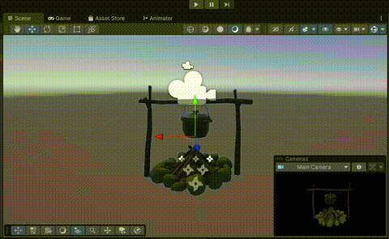
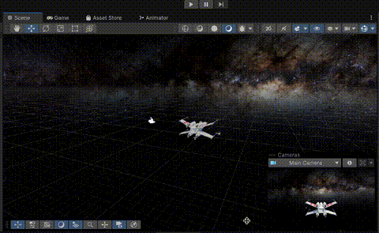
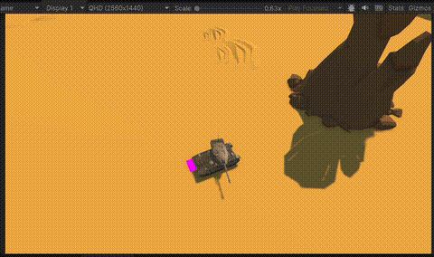
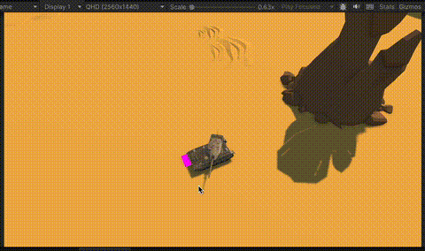
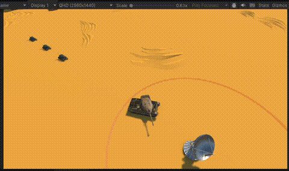

# Tank game
Created by: Jingwen Zhuang & Oskar Hokkanen Eriksson

## Techniques
- Raycasting 
- Quaternion rotation
- Particle system
- Sound system 
- LOD

## Results
### Firepit & X-wing particles

### Tank game

